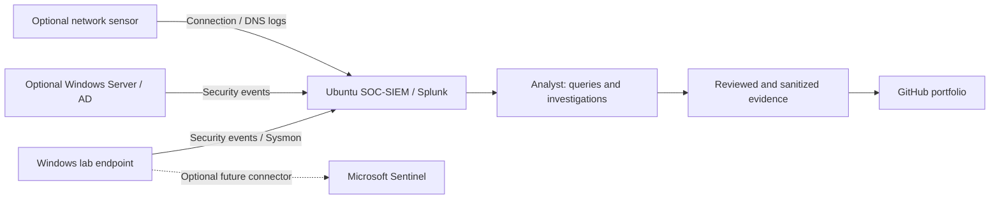

# Proposed lab architecture

**Planning diagram only.** A [VM inventory observation](../investigations/LAB-000-environment-readiness.md) is available with a screenshot. Guest configuration, network isolation, forwarding, and ingestion have not been verified.

## Actual inventory — complete from observation

| Component | Lab alias | Version | Logging configuration | Verified date |
| --- | --- | --- | --- | --- |
| Windows endpoint | TODO | TODO | TODO | Not verified |
| SIEM | TODO | TODO | TODO | Not verified |
| Optional domain controller | TODO | TODO | TODO | Not verified |
| Optional sensor / Sentinel | TODO | TODO | TODO | Not verified |

Describe the isolated virtual switch, permitted traffic, retention, timezone, snapshots, and forwarding configuration here. Use aliases rather than real IP addresses. Do not expose a lab login page to the public internet for this portfolio.
