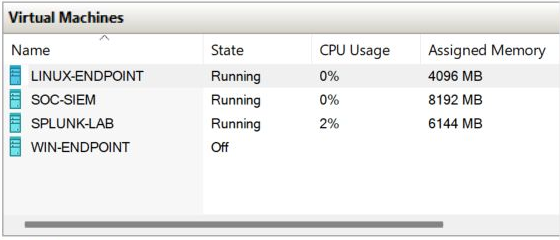

# LAB-000 — Environment readiness observation

**Status: observation captured; detection testing has not started.**

## Scope

Read-only inspection of the user's Hyper-V lab inventory on 2026-09-27, approximately 20:48 UTC. No endpoint changes, test logons, payload execution, containment, or remediation were performed during this observation.

## Evidence

The image is a crop of an actual Hyper-V Manager screenshot. Cropping removes the host computer name and surrounding UI; the VM rows are unchanged. It records a point in time, not ongoing availability.

Published PNG SHA-256: `95977b18e45e78405caeca8ab480765b31d35014c9c94832ccbc3dd8df18b3eb`.

| VM | Observed state | Assigned memory shown |
| --- | --- | --- |
| LINUX-ENDPOINT | Running | 4096 MB |
| SOC-SIEM | Running | 8192 MB |
| SPLUNK-LAB | Running | 6144 MB |
| WIN-ENDPOINT | Off | No assigned memory shown |

## Access and telemetry readiness

- Splunk's browser tab displayed an expired session and required the owner to sign in.
- Hyper-V inventory commands and the open VM connection dialog reported insufficient permissions for the current automation session.
- The VM names do not establish installed operating systems, SIEM versions, agent health, network isolation, or log ingestion. Those remain unverified.
- No successful connection to an endpoint or detection execution is claimed in this record.

## Next checks

After access is available, verify the endpoint's state, collect the actual SIEM source/field mapping, and run positive and negative detection checks. Record each test independently, including unexpected results and limitations.

## Authorship

The observation, screenshot capture, and draft documentation were performed with AI assistance at the user's request. The screenshot is evidence of the displayed inventory only.
