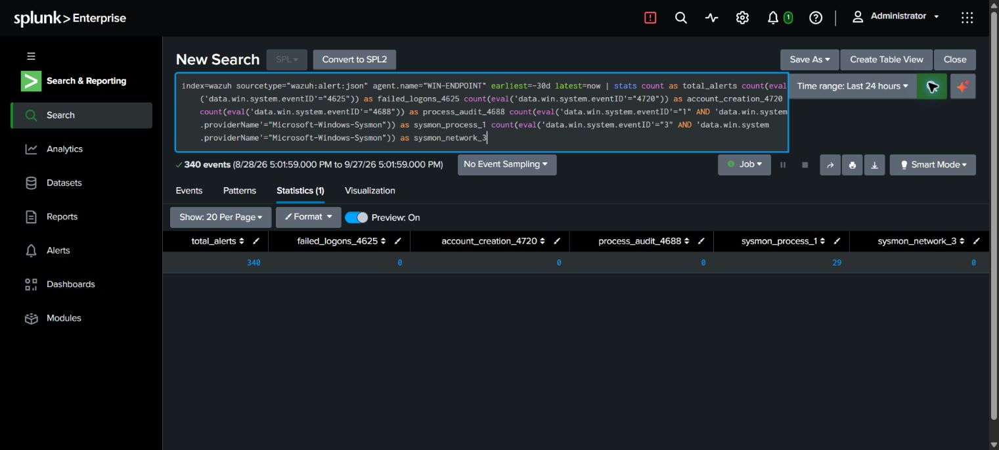

# LAB-000 — Observed telemetry coverage

**Read-only coverage assessment completed in Splunk on 2026-09-27. Fresh test collection remains pending.**

## What the search found

A 30-day `tstats` inventory returned one accessible non-internal source: index `wazuh`, sourcetype `wazuh:alert:json`, host `SIEM`, with 3,839 events. This describes the searched account's accessible data, not every possible index or system.

The Windows agent subset contained 340 alerts:

| Required telemetry | Observed count |
| --- | --- |
| Failed logon 4625 | 0 |
| Account creation 4720 | 0 |
| Process audit 4688 | 0 |
| Microsoft-Windows-Sysmon event 1 | 29 |
| Microsoft-Windows-Sysmon event 3 | 0 |

[Executed coverage query](../splunk/wazuh-windows-coverage.spl). Queries contain explicit 30-day modifiers even though the UI picker reads Last 24 hours. Source is Wazuh alerts, not necessarily every Windows audit event. Zero results do not establish that auditing is disabled; forwarding/filtering, retention, event generation, permissions and extraction must be checked.

## Extraction finding

Adding a redundant unrestricted `spath` to already extracted JSON fields inflated multi-field grouped counts by eight in the exploratory query. For example, the dpkg half-configured group showed 6,040 with the extra extraction and 755 without it. A separate check without `spath` found `mvcount(agent.name)=1` and `mvcount(rule.id)=1` for all 3,839 events. The final reviews use existing fields without redundant extraction. No global Splunk configuration was changed.

## Memory-aware execution plan

Keep only the VMs needed for the current exercise running. Splunk currently contains historical Wazuh alerts, so historical review can proceed without all endpoints online. **Fresh telemetry may require the Wazuh manager/forwarder as well as Splunk and the active endpoint.** Do not assume the proposed two-VM setup is sufficient until the forwarding path is verified. VM roles and exact transport are not fully verified.

## Remaining work

- Verify current WIN-ENDPOINT access and the collection/forwarding path.
- Generate authorized, harmless Windows positive/negative tests and confirm ingestion.
- Validate account creation and network detections with the required telemetry.
- Run KQL in a configured Sentinel workspace and convert/test Sigma with an appropriate backend; neither is complete.
- Complete any incident report only after evidence supports its findings. No compromise, malware infection, or remediation is claimed.
