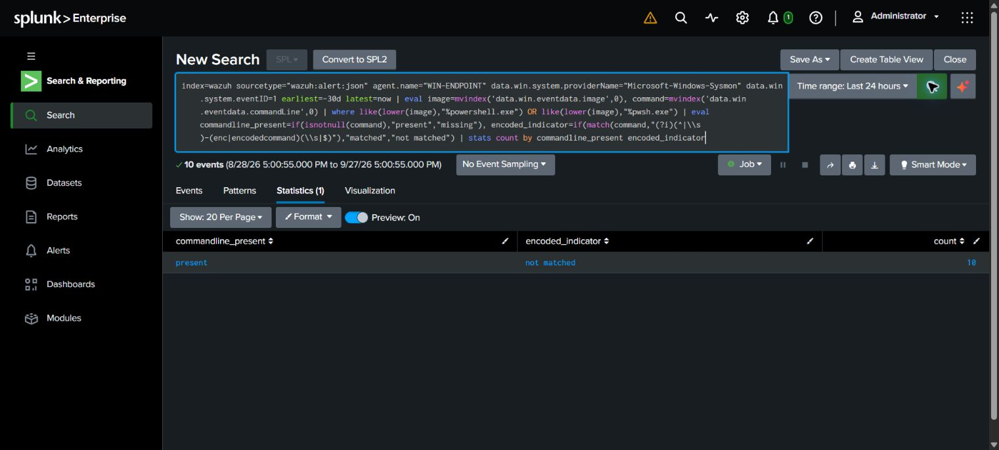
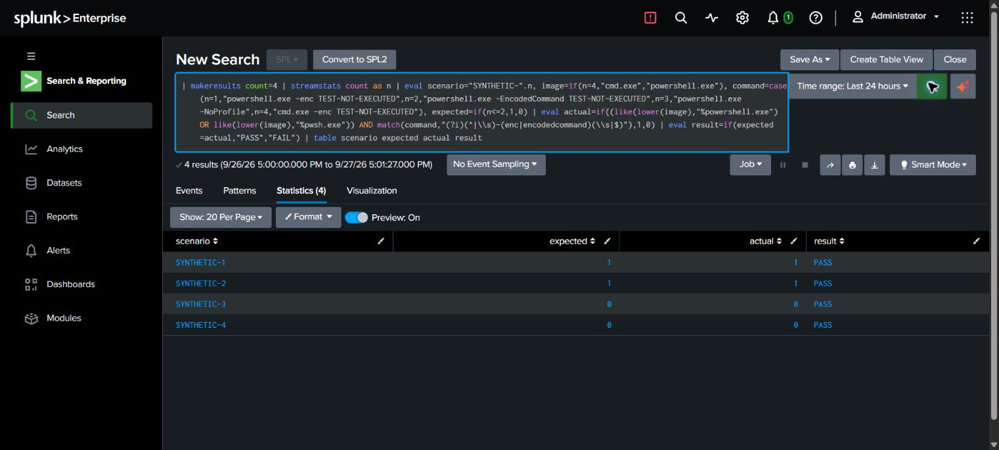

# LAB-002 — Historical PowerShell indicator review

**Completed scope: historical process review and four synthetic matching tests. Fresh endpoint execution and end-to-end detection validation: NOT PERFORMED.**

## Source and execution

Executed in Splunk Enterprise 10.4.3 on 2026-09-27. Evidence screenshots were saved at 21:01:21 and 21:01:52 UTC. Explicit 30-day window; `index=wazuh`, `sourcetype="wazuh:alert:json"`, agent `WIN-ENDPOINT`. Source fields were verified from actual indexed data.

The data contains 29 Sysmon event 1 alerts, including **10 PowerShell process events**. This lab uses `data.win.eventdata.image` and `data.win.eventdata.commandLine`; it does not use the original 4688 starter query.

## Historical result

All ten PowerShell events had a command-line field. **Zero matched** the `-enc` or `-encodedcommand` token pattern. Raw command lines and account identities are omitted from the published results.

This does not establish that these processes were benign or that encoded PowerShell never ran. It establishes only that this pattern did not match the available ten events.

## Synthetic matching tests

Four strings were evaluated inside Splunk; none was executed as a system command:

| Case | Input category | Expected match | Observed |
| --- | --- | --- | --- |
| SYNTHETIC-1 | PowerShell with `-enc` and inert placeholder text | Yes | PASS |
| SYNTHETIC-2 | PowerShell with `-EncodedCommand` and inert placeholder text | Yes | PASS |
| SYNTHETIC-3 | PowerShell with `-NoProfile` | No | PASS |
| SYNTHETIC-4 | cmd.exe with an encoded-looking switch | No | PASS |

## Reproduction and limitations

- [Historical Wazuh query](../splunk/wazuh-powershell-review.spl)
- [Executed synthetic test](../splunk/powershell-synthetic-validation.spl)

The image suffix test can match similarly suffixed filenames; a stricter basename check is future tuning. Switch abbreviations other than the two tested tokens, tabs/quoting variants, renamed binaries, and other interpreters are not comprehensively tested. Encoded commands can be legitimate administrative activity. Missing records in an alert-only index are a coverage limitation.

Disposition: **no match for this indicator in the available sample; no malware or compromise determination**. No endpoint changes or response actions were performed. AI assistance was used to execute searches, capture screenshots, and draft the analysis. Original SPL/KQL/Sigma starters remain unvalidated against a fresh lab exercise.
