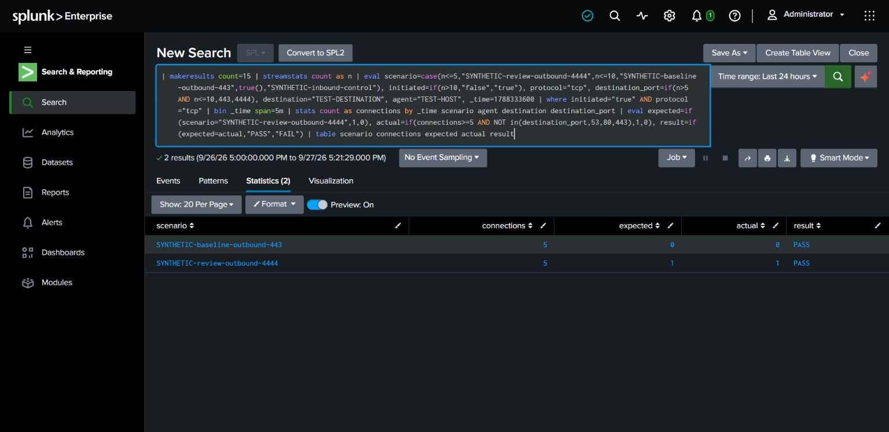

# LAB-004 — Outbound network review logic exercise

**Completed:** synthetic logic exercise in Splunk. **Blocked for live validation:** no Sysmon network event 3 records or another network source were observed in the assessed dataset.

## Hypothesis and exercise baseline

For this illustrative exercise only, five outbound TCP connections in a fixed five-minute group to a port outside `{53,80,443}` are sent for analyst review. This is an invented training baseline, not an observed baseline or a claim that these ports are safe. Real environments require an approved application/destination baseline and process context.

## Test performed on 2026-09-27

A `makeresults` fixture created 15 temporary rows: five outbound connections to port 4444, five outbound connections to port 443, and five inbound controls. The inbound records were excluded before aggregation. The two remaining groups produced the expected result:

| Group | Connections | Expected review | Actual |
| --- | --- | --- | --- |
| Synthetic outbound 4444 | 5 | Yes | PASS |
| Synthetic outbound 443 | 5 | No | PASS |

[Executed query](../splunk/network-synthetic-validation.spl). No sockets were opened by the query; this was not packet capture or a network attack simulation.

## Analyst interpretation

A non-baseline port is a review lead, not proof of command and control. Legitimate applications use alternate ports; malicious traffic can use 443. Correlate process, parent process, DNS, destination ownership, change history, volume and timing. Missing data and fixed time buckets can hide activity. There is no supported malware or exfiltration finding from this exercise.

## Live completion criteria

Verify Sysmon event 3 or Zeek coverage; document the actual fields and baseline; make a harmless connection to an owned lab destination; capture the endpoint event and SIEM result; and confirm a negative control. These steps remain pending. The [guarded Windows harness](../scripts/powershell/Run-WindowsLabTests.md) is prepared but not executed. Work was AI-assisted.
