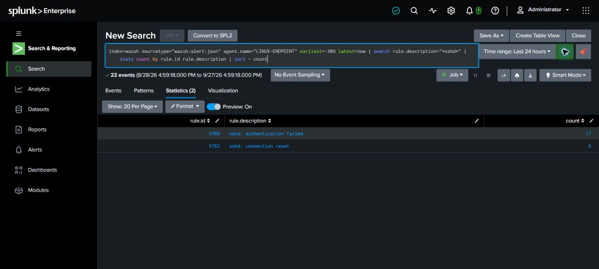
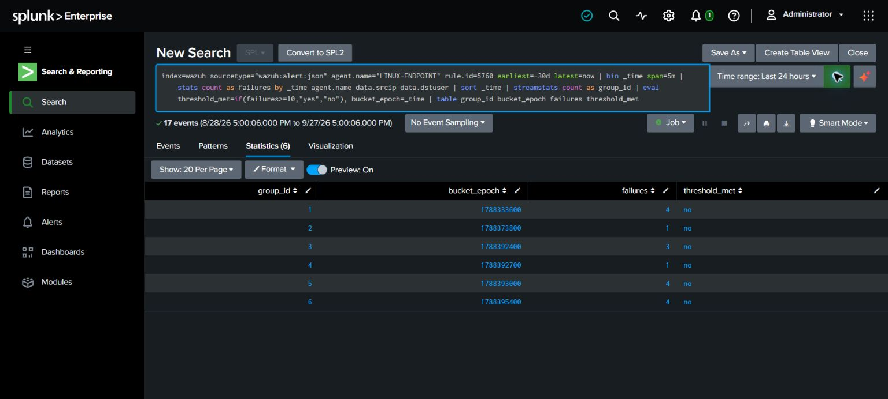
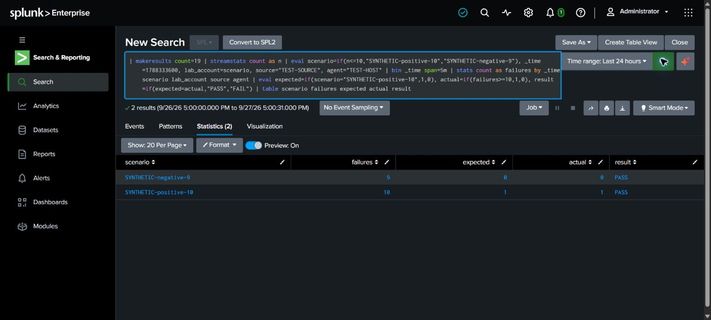

# LAB-005 — Historical SSH authentication review

**Completed scope: historical alert review and synthetic threshold boundary test. Fresh SSH attack simulation and end-to-end alert validation: NOT PERFORMED.**

## Environment and method

Executed through the signed-in Splunk Enterprise 10.4.3 UI on 2026-09-27. Evidence screenshots were saved between 20:59:45 and 21:00:49 UTC. Source: `index=wazuh`, `sourcetype="wazuh:alert:json"`, agent `LINUX-ENDPOINT`. Searches used explicit `earliest=-30d latest=now`; those modifiers overrode the UI's Last 24 hours picker. Screenshots show the effective result window. Relative windows will move on rerun.

These are Wazuh **alerts**, not a complete SSH authentication audit trail. No assumption is made that every failed or successful login reached this index.

## Observations

- 23 indexed alerts had an SSH-related rule description: 17 rule `5760` authentication failures and 6 rule `5762` connection resets.
- All 17 failure alerts contained `data.srcip` and `data.dstuser`.
- Grouping by five-minute bucket, agent, source and target user produced six groups with counts **4, 1, 3, 1, 4, 4**, summing to 17.
- None reached the illustrative threshold of ten. This is a negative result for this search, not proof that brute force never occurred.
- The previously existing LAB-005 saved-alert screen showed no fired events when opened. Its schedule, search, execution history, and delivery path were not validated or changed.

Source/user identities were removed from the displayed table after grouping. `group_id` identifies a result row; it is not a persistent actor identity. `bucket_epoch` is Unix time and avoids timezone ambiguity.

## Synthetic boundary test

The separate `makeresults` search created 19 temporary in-memory rows: ten in one group and nine in another. Both expected outcomes passed: ten matched, nine did not. No authentication attempts were made and nothing was ingested into the lab index.

This tests the grouping/count comparison on a fixture. It does not prove collection, field extraction on future events, scheduling, suppression, notification, or incident response.

## Reproduce and assess

- [Historical review query](../splunk/wazuh-ssh-bucket-review.spl)
- [Synthetic threshold test](../splunk/ssh-synthetic-threshold-validation.spl)

Disposition: **insufficient evidence to conclude brute force or account compromise**. Benign explanations include mistyped passwords and prior lab exercises; the original actor intent is not established. Connection resets were not counted as password failures. No containment was performed.

Limitations: alert-only coverage, fixed-bucket boundary effects, an illustrative threshold, possible source/user variation, and no fresh positive end-to-end test. Queries and documentation were executed/prepared with AI assistance; this is not represented as independently completed work by the portfolio owner.
