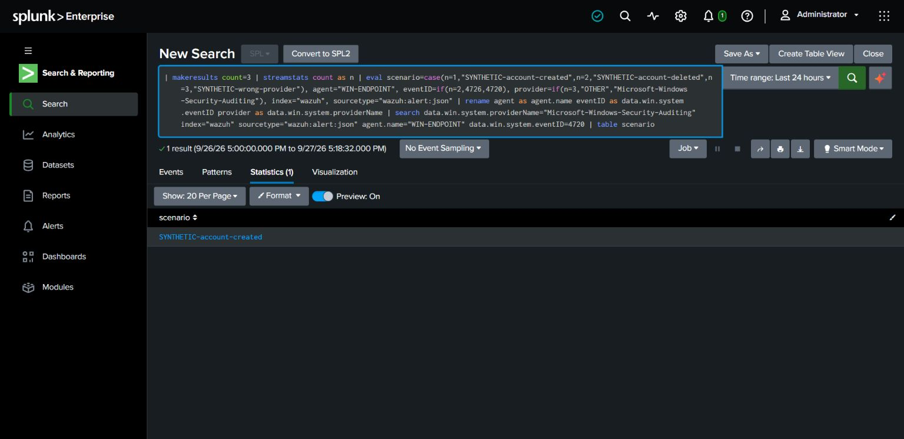
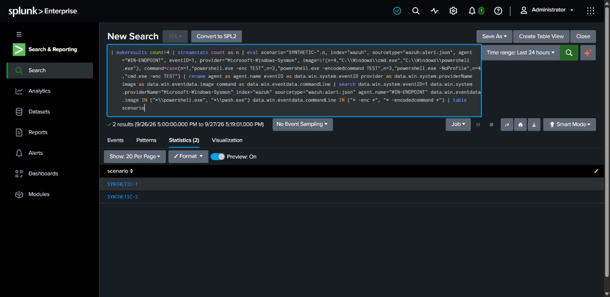

# LAB-006 — Sigma rule checks, conversion and fixture validation

**Completed:** official rule checks, conversion to Wazuh-aware SPL, and generated-query fixture tests in Splunk. **Pending:** fresh endpoint events and end-to-end alert operation.

## Toolchain and rule checks

Executed on 2026-09-27 in an isolated local Python environment: sigma-cli 3.1.0, pySigma 1.5.1, pysigma-backend-splunk 2.1.0. Both `account-creation.yml` and `suspicious-powershell.yml` passed `sigma check`: **0 errors, 0 condition errors, 0 issues**. Rules remain `experimental` because these limited tests do not justify production-ready status.

```text
sigma check sigma/account-creation.yml sigma/suspicious-powershell.yml
sigma convert -t splunk -p sigma/wazuh-splunk-pipeline.yml sigma/account-creation.yml
sigma convert -t splunk -p sigma/wazuh-splunk-pipeline.yml sigma/suspicious-powershell.yml
```

## Field mapping

The [pipeline](../sigma/wazuh-splunk-pipeline.yml) scopes the search to the lab Wazuh index, sourcetype and Windows agent. It maps `EventID`, `Image` and `CommandLine` to observed Wazuh JSON field names. The Security provider was verified from 13 existing event 4624 records. Process creation is scoped to Microsoft-Windows-Sysmon event 1.

Generated outputs: [account creation](../splunk/sigma-account-creation-generated.spl), [PowerShell](../splunk/sigma-powershell-generated.spl).

## Executed fixture results

| Rule | Synthetic cases | Expected | Observed |
| --- | --- | --- | --- |
| Account creation | 4720 on Security provider; 4726 control; wrong-provider 4720 control | Only account-created case | Only account-created case |
| PowerShell | `-enc`; `-encodedcommand`; ordinary PowerShell; cmd.exe control | Cases 1 and 2 | Cases 1 and 2 |





Exact executed fixtures: [account](../splunk/sigma-account-synthetic-validation.spl), [PowerShell](../splunk/sigma-powershell-synthetic-validation.spl). Strings were not executed as commands, and fixture events were not ingested. The complete generated search predicates, including source-scoping fields constructed for the fixture, were exercised.

An initial account fixture returned no matches because its dotted fields were constructed incorrectly. Inspecting the fixture showed empty columns. Constructing simple aliases and then using `rename` fixed the fixture; the screenshots show the corrected run. This was a fixture defect, not a validated account-creation failure in the endpoint.

## Limits

The PowerShell rule recognizes two literal space-delimited spellings, not every abbreviation, tab, quoting form, or renamed binary. Account creation is informational. Conversion and fixture matching do not prove logging, collection, alert scheduling, or coverage against an adversary. No Windows account was created by these Splunk tests.

Method: [official Sigma conversion guide](https://sigmahq.io/docs/guide/getting-started.html) and [processing pipeline reference](https://sigmahq.io/docs/digging-deeper/pipelines.html). Execution and documentation were AI-assisted.
