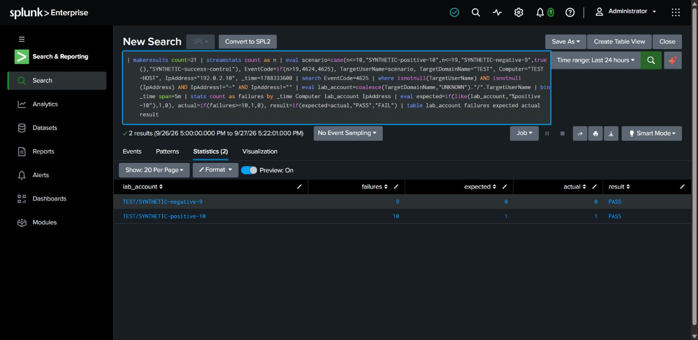

# Windows authentication detection exercise

**Completed:** synthetic threshold and successful-logon exclusion checks. **Not complete:** fresh Windows failed-logon collection and end-to-end alert validation.

On 2026-09-27, a 21-row Splunk in-memory fixture included ten failures for one synthetic account, nine for another, and two successful-logon controls (4624). Successful logons were excluded by the 4625 selection. Domain/account, host, source and fixed five-minute grouping produced the expected ten-versus-nine boundary behavior.

| Case | Count | Expected match | Actual |
| --- | --- | --- | --- |
| Synthetic positive | 10 | Yes | PASS |
| Synthetic negative | 9 | No | PASS |

[Executed fixture](../splunk/windows-authentication-synthetic-validation.spl). The `192.0.2.10` address is reserved documentation data. No real authentication attempts were made by this query and no endpoint data was ingested. This tests the core logic of the original SPL starter, not its index/sourcetype mapping.

The historical coverage query found zero 4625 records in the Windows Wazuh subset. A local API-generated logon failure can lack a meaningful source IP, so it requires careful field review. Time-bucket boundaries, missing fields, distributed sources and low-volume attempts remain limitations. No brute-force attack, compromise, or containment is asserted. Execution and documentation were AI-assisted.
